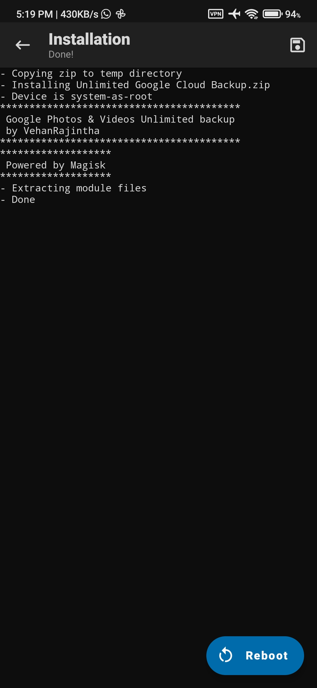
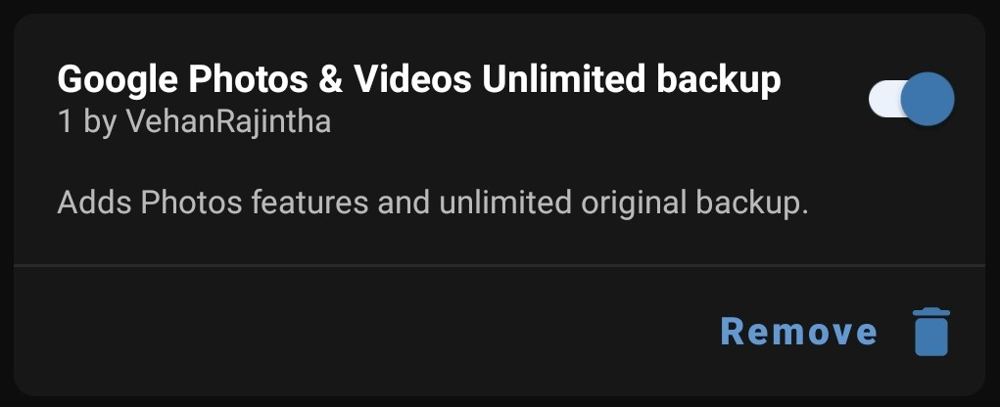

# Free-Unlimited-Google-Cloud-Backup-Magisk-Module

This is a Magisk module and from this you can get Unlimited Google Cloud Storage to backup Photos and Videos on your device.

**Requirments**

- Android 4 +
- Rooted Rom
- Magisk app

**How it works**
  
  Briefly speaking about this, what happens here is that your device is spoofed as a google pixel device so that it is detected by google. Because the pixel devices are made by the google company, they provide unlimited google cloud storage. By using this module, google pixel use Even you who don't can experience this feature.

**How to do this**

- Download the magisk zip file in assets
-  Open magisk app & enter module tab
-  Select the magisk zip file
-  Then flash.
  

  

